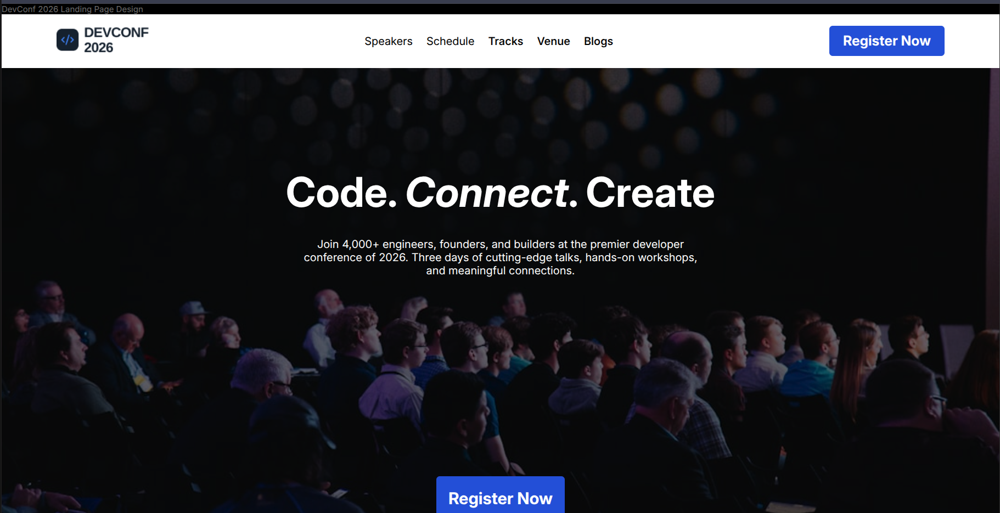

# 🚀 PH Assignment 01 - Interactive Web Project

A clean, modern, and fully responsive web application built to showcase fundamental web design principles, structured layouts, and CSS styling techniques. Developed as the first assignment under the **Programming Hero** Web Development Course.

🌐 **Live Demo:** [Click Here to View Live App](https://aminul-72.github.io/PH_Assignment-01/)  
📁 **Repository Link:** [GitHub Repository](https://github.com/AmiNuL-72/PH_Assignment-01)

---

## 📸 Project Screenshot

<p align="center">
  
</p>

---

## ✨ Key Features

- 📱 **Fully Responsive Layout:** Optimized for mobile, tablet, and desktop viewports.
- 🎨 **Modern & Clean UI:** Designed with cohesive typography, visual hierarchy, and color palettes.
- ⚡ **Cross-Browser Compatibility:** Renders seamlessly across modern browsers like Chrome, Firefox, and Edge.
- 🎯 **Semantic HTML Structure:** Built following accessibility standards and clean coding practices.
- 🛠️ **Flexbox & CSS Styling:** Styled using custom layout techniques without heavy external UI frameworks.

---

## 🛠️ Main Technologies Used

| Category | Technology |
| :---: | :---: |
| **Markup Language** | <a href="https://skillicons.dev"></a> |
| **Styling & Layout** | <a href="https://skillicons.dev"></a> |
| **Version Control** | <a href="https://skillicons.dev"></a> |

---

## 📦 Dependencies & External Resources

This project is lightweight and does not rely on heavy external frameworks. It utilizes:

- **Google Fonts:** For modern and readable web typography.
- **FontAwesome / Simple Icons:** For vector icons and brand badges.
- **Normalize / CSS Reset:** To ensure consistent default styling across different web browsers.

---

## 💻 How to Run Locally

Follow these simple steps to run this project on your local machine:

### **1. Clone the Repository**
Open your terminal/command prompt and run:
```bash
git clone https://github.com/AmiNuL-72/PH_Assignment-01.git
```
### **2. Navigate to the Directory**
```bash
cd PH_Assignment-01
```
### **3. Open the Project**
- Double-click on `index.html` to open it in your default web browser.
- Alternatively, open the directory in **VS Code** and click **Go Live** using the **Live Server** extension.
